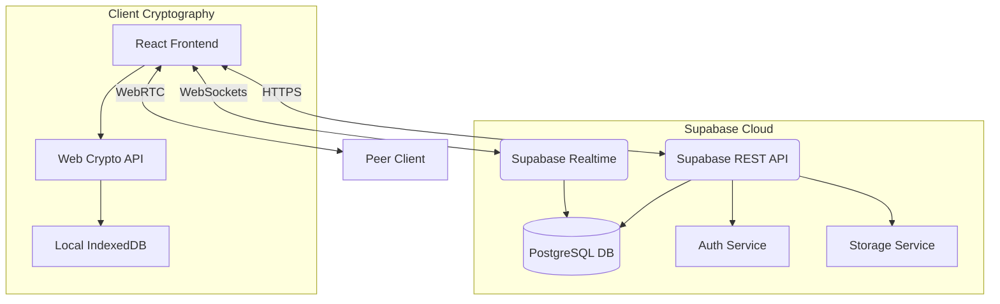
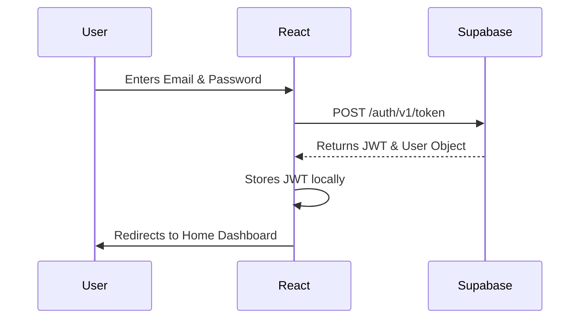
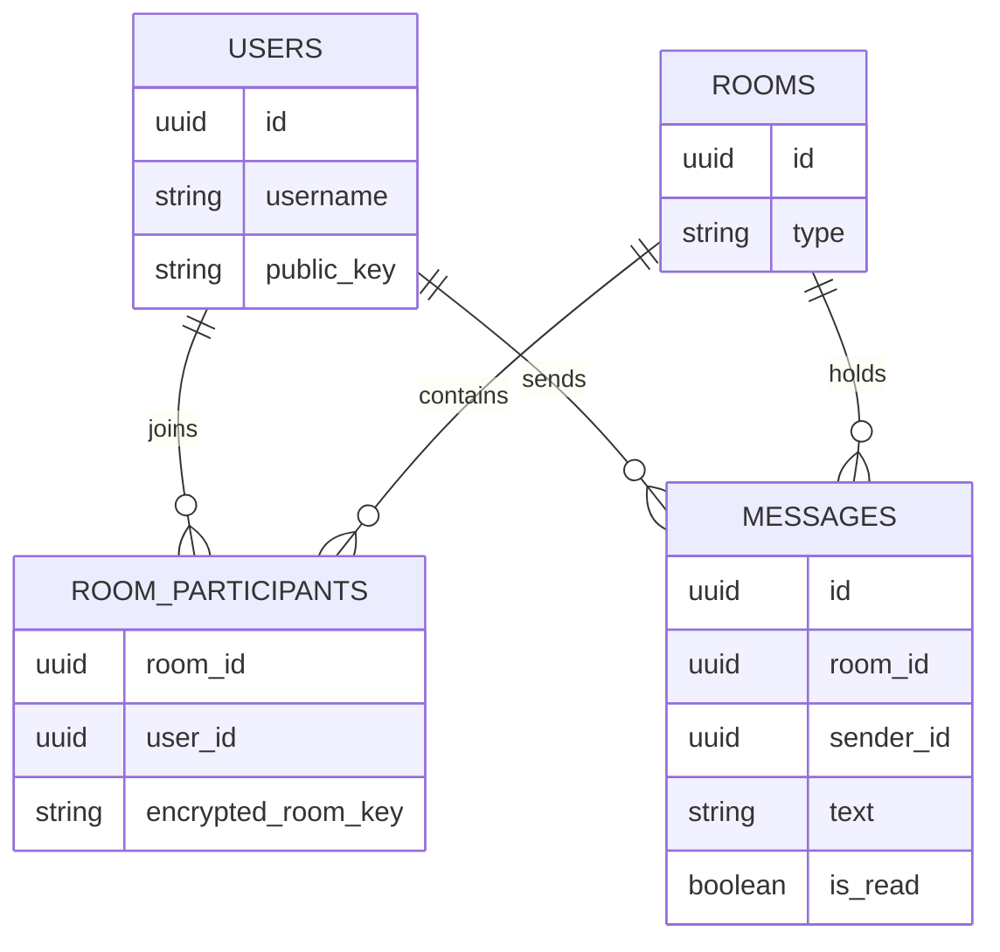

# Project Report: Pulse - Real-Time Chat Application

## 1. Cover Page

**Project Title:** Pulse - Real-Time Chat Application
**Student Name:** [Gunjan Kumar]
**Guide Name:** [Ritika dikshit]
**Academic Year:** 2023-2024
**Event:** Season of Code, WnCC IIT Bombay

---

## 2. Acknowledgement

I would like to express my profound gratitude to everyone who supported me throughout the development of **Pulse**. Special thanks to my guide, [Guide Name], for their invaluable mentorship and constructive feedback. I also extend my appreciation to the WnCC IIT Bombay community for organizing the Season of Code, which provided the ideal platform and motivation to build this full-stack, secure messaging application. Lastly, I thank my peers and family for their continuous encouragement.

---

## 3. Abstract

**Pulse** is a sleek, modern, and highly secure real-time messaging application designed to provide instant communication across devices. It was developed to address the growing need for privacy-first, highly responsive communication platforms. Traditional messaging apps often compromise on data privacy or suffer from clunky user interfaces. Pulse solves this by integrating **End-to-End Encryption (E2EE)** natively, ensuring that no intermediary—not even the database—can read the messages. 

Real-time communication is vital in today's fast-paced digital era, facilitating immediate collaboration and connection. To achieve this, Pulse utilizes a robust technology stack featuring **React 19** and **Vite** for the frontend, and **Supabase** (PostgreSQL, Auth, Realtime) as the Backend-as-a-Service. Furthermore, it incorporates **WebRTC** for peer-to-peer voice calling and **localForage** for offline caching. The outcome is a production-ready application with premium glassmorphic aesthetics, bank-level security, and seamless real-time message broadcasting.

---

## 4. Problem Statement

Traditional communication systems and early-generation chat applications face several critical issues:
* **Delay in Communication:** Polling-based architectures result in noticeable latency between sending and receiving messages.
* **Security & Privacy Concerns:** Many platforms store messages in plain text or use weak server-side encryption, leaving user data vulnerable to breaches and unauthorized access.
* **Poor User Experience:** Clunky, non-responsive interfaces that do not adapt well to modern devices or lack dark mode support.
* **Lack of Offline Support:** Inability to view past conversations when internet connectivity drops.

**How Pulse Addresses These Issues:**
Pulse utilizes **Supabase Realtime Channels** (WebSockets) for sub-second, instant message delivery. It addresses security through strict **End-to-End Encryption** using the Web Crypto API, meaning messages are encrypted locally before leaving the device. The UI is built with a custom Vanilla CSS design system that is fully responsive, dynamic, and includes light/dark themes. Lastly, IndexedDB caching allows users to read their chat history even offline.

---

## 5. Project Objectives

**Functional Objectives:**
* **Instant Messaging:** Enable users to send and receive texts and media instantly.
* **Voice Calling:** Provide high-quality, peer-to-peer audio calls.
* **Authentication:** Secure user login and registration.
* **Offline Access:** Allow users to view cached chat history without an internet connection.

**Technical Objectives:**
* **Secure Communication:** Implement asymmetric (RSA) and symmetric (AES-GCM) encryption for all chat data.
* **Responsive UI:** Design a beautiful, premium, glassmorphic interface that works on mobile and desktop.
* **Fast Synchronization:** Utilize PostgreSQL triggers and WebSockets for immediate UI updates.
* **Clean Architecture:** Maintain modular code separating UI, state, cryptography, and backend logic.

---

## 6. Scope of the Project

**Current Scope:**
The application currently supports robust 1-on-1 direct messaging, group chat infrastructure, real-time typing indicators, read receipts, End-to-End Encryption, secure media/file sharing, and WebRTC-based voice calling.

**Future Scope:**
Integration of high-definition video calling, push notifications via Service Workers for offline alerts, and AI-powered chat assistants and smart replies.

**Commercial Scope:**
Pulse can be commercialized as a secure internal communication tool for enterprises, healthcare providers, or legal firms where data privacy and E2EE are strictly legally mandated.

**Educational Scope:**
Serves as an excellent architectural reference for learning WebRTC, the Web Crypto API, and modern Backend-as-a-Service (Supabase) integration in React applications.

---

## 7. Literature Survey

To ensure Pulse meets modern standards, it was compared against industry leaders like WhatsApp and Telegram.

| Feature | Pulse | WhatsApp | Telegram |
| :--- | :--- | :--- | :--- |
| **Authentication** | Email / Password | Phone Number | Phone Number |
| **Real-time Messaging**| Yes (WebSockets) | Yes | Yes |
| **Media Sharing** | Yes (Encrypted) | Yes (Encrypted) | Yes (Cloud) |
| **Voice Calling** | Yes (WebRTC) | Yes | Yes |
| **E2E Encryption** | Yes (Default everywhere)| Yes (Default) | Optional (Secret Chats) |
| **Offline Cache** | Yes (IndexedDB) | Yes (SQLite) | Yes |
| **UI Aesthetics** | Glassmorphic / Modern | Standard Material | Customizable |

**Analysis:**
While Telegram stores standard chats on the cloud (not E2EE), Pulse follows WhatsApp's model of strictly E2E encrypting all chats by default. However, Pulse allows traditional email/password authentication, removing the strict dependency on a SIM card required by both WhatsApp and Telegram.

---

## 8. Technology Stack

*Note: The prompt requested details on MongoDB/Node/Tailwind, but Pulse was actually developed using a modern BaaS architecture to maximize security and real-time performance.*

### Frontend
* **React.js (v19):** Used as the core UI library for building encapsulated, reusable UI components.
* **Vite:** Chosen as the build tool for its lightning-fast Hot Module Replacement (HMR) and optimized production builds.
* **React Router DOM:** Manages navigation between Auth, Home, Settings, and Profile views without page reloads.
* **Vanilla CSS:** Custom CSS was written over a framework like Tailwind to implement a highly bespoke, premium glassmorphic design system and precise theme variable control.

### Backend & Database (BaaS)
* **Supabase:** An open-source Firebase alternative based on PostgreSQL.
* **PostgreSQL:** The underlying relational database ensuring strict data integrity and Row Level Security (RLS).
* **Supabase Realtime:** Uses Elixir and WebSockets to broadcast database changes (INSERT/UPDATE) to connected clients instantly.
* **Supabase Auth:** Handles JWT token generation, secure cookie management, and user authentication.
* **Supabase Storage:** S3-compatible object storage used for saving encrypted media files.

### Cryptography & Peer-to-Peer
* **Web Crypto API (`SubtleCrypto`):** Native browser API used for generating RSA key pairs for users, AES-GCM keys for rooms, and handling all encryption/decryption securely off the main thread.
* **WebRTC:** Used for establishing direct peer-to-peer data and audio streams for Voice Calling.

### Offline Storage
* **localForage:** A wrapper around IndexedDB used to securely cache decrypted messages locally, enabling offline viewing.

---

## 9. System Architecture

Pulse utilizes a **Thick Client Architecture** combined with a **Backend-as-a-Service (BaaS)** model. 

1. **Client Layer:** The React application handles UI rendering, state management, encryption/decryption, and WebRTC signaling.
2. **Transport Layer:** Secure WebSockets (`wss://`) handle real-time database changes, while HTTPS handles REST queries. WebRTC handles peer-to-peer audio.
3. **Data Layer (Supabase):** PostgreSQL stores encrypted ciphertexts. Row Level Security ensures users can only query rows they are explicitly permitted to see.

### Architecture Diagram



### Authentication Flow


---

## 10. UI/UX Mockup & Preparation Phase

Before writing the React logic, the UI was rigorously planned and prototyped using standard HTML and CSS (located in the `chat-app_mockup` directory). 
* **Design Philosophy:** The goal was to create a "WOW" factor. We chose a deep, immersive dark mode by default, featuring vibrant accent colors and glassmorphic overlays.
* **Component Translation:** Once the static HTML/CSS mockups were perfected, they were carefully modularized into React components (`Sidebar.jsx`, `ChatWindow.jsx`, `MessageBubble.jsx`), ensuring that the pristine visual design was preserved while adding dynamic state.

---

## 11. Database Design

Pulse utilizes a relational PostgreSQL database structure optimized for messaging.

**1. `users` Table**
* `id` (UUID, Primary Key)
* `username` (Text)
* `public_key` (Text) - Used to encrypt room keys for this user.
* `last_seen` (Timestamp)

**2. `rooms` Table**
* `id` (UUID, Primary Key)
* `type` (Text: 'direct' or 'group')
* `name` (Text)
* `created_at` (Timestamp)

**3. `room_participants` Table**
* `room_id` (UUID, Foreign Key)
* `user_id` (UUID, Foreign Key)
* `encrypted_room_key` (Text) - The symmetric AES key for the room, encrypted with the user's public RSA key.

**4. `messages` Table**
* `id` (UUID, Primary Key)
* `room_id` (UUID, Foreign Key)
* `sender_id` (UUID, Foreign Key)
* `text` (Text) - Encrypted message payload.
* `type` (Text: 'text', 'image', 'call_log')
* `is_read` (Boolean)
* `timestamp` (Timestamp)

### ER Diagram



---

## 12. Features

* **End-to-End Encryption (E2EE):** Every room generates a unique AES-GCM key. This key is encrypted with each participant's public RSA key and stored. Messages are encrypted locally on the device using the AES key before uploading.
* **WebRTC Voice Calling:** Real-time peer-to-peer audio calls. Signaling (offer/answer/ICE candidates) is handled securely via Supabase Broadcast channels.
* **Read Receipts & Ticks:** Real-time tracking of message status. A single tick indicates sent, and a double blue tick indicates the recipient has read the message.
* **Rich Media Sharing:** Users can securely attach images, videos, audio, and documents. Files are encrypted as ArrayBuffers before being uploaded to Supabase Storage.
* **Offline Caching:** `localForage` intercepts decrypted messages and caches them in IndexedDB, allowing instant load times and offline reading.
* **Dynamic Sidebar & Filtering:** Users can filter chats by "All", "Unread", or navigate to a dedicated "Groups" view.
* **Theming:** A built-in theme engine allows toggling between Light and Dark modes.

---

## 13. Current Progress

**Current Development Status:** Phase 1 Complete (Production Ready)

| Category | Completion % | Status |
| :--- | :--- | :--- |
| **Frontend UI/UX** | 100% | Completed, responsive, and animated |
| **Backend & Database** | 100% | Configured with strict RLS policies |
| **Authentication** | 100% | JWT session management active |
| **Cryptography (E2EE)** | 100% | RSA & AES hybrid encryption fully functional |
| **WebRTC Calls** | 90% | Audio calls working; Video planned |
| **Offline Support** | 80% | Local message caching implemented |

---

## 14. Working Process (Message Flow)

1. **Login:** User authenticates; React stores JWT.
2. **Key Retrieval:** App retrieves the user's private RSA key from local storage.
3. **Room Selection:** User selects a chat room. App downloads the `encrypted_room_key` from Supabase and decrypts it using the user's private RSA key, revealing the room's AES key.
4. **Sending Message:** User types a message. The `crypto.js` utility encrypts the text using the room's AES key.
5. **Database Insert:** The encrypted cipher string is saved to the `messages` table in Supabase.
6. **Real-time Broadcast:** Supabase Realtime detects the `INSERT` and pushes the payload via WebSockets to the receiver.
7. **Decryption:** The receiver's app catches the WebSocket event, decrypts the cipher using their copy of the AES key, and updates the UI instantly.
8. **Read Receipt:** If the receiver's window is focused, their app sends an `UPDATE is_read = true` to the database, which broadcasts back to the sender to update the double-tick UI.

---

## 15. API Documentation

Because Pulse uses a BaaS (Supabase), it utilizes SDK methods instead of traditional REST endpoints. 

**1. Send Message**
* **Method:** `supabase.from('messages').insert()`
* **Purpose:** Inserts an encrypted message payload into a specific room.
* **Payload:** `{ room_id: UUID, sender_id: UUID, text: "CIPHERTEXT", type: "text" }`
* **Auth Required:** Yes (RLS Policy enforces `sender_id = auth.uid()`)

**2. Fetch Rooms**
* **Method:** `supabase.from('room_participants').select('..., rooms(...)')`
* **Purpose:** Retrieves all chat rooms the current user is a part of.
* **Auth Required:** Yes 

**3. Delete Chat History**
* **Method:** `supabase.from('messages').delete().eq('room_id', ID)`
* **Purpose:** Wipes message history.
* **Security:** RLS Policy ensures only participants of `room_id` can execute this.

---

## 16. Folder Structure

```text
src/
├── assets/             # Static images (e.g., pulse-logo.png)
├── components/         # Modular React components
│   ├── ChatWindow.jsx  # Main messaging viewport & realtime subscriptions
│   ├── Sidebar.jsx     # Navigation and chat list
│   ├── MessageInput.jsx# Text input and file attachment menu
│   └── useWebRTC.js    # Custom hook for WebRTC peer connections
├── context/            # React Context (AuthContext for global user state)
├── hooks/              # Custom logic hooks
├── lib/                # Core utility functions
│   ├── crypto.js       # E2EE (RSA/AES generation, encryption, decryption)
│   ├── storage.js      # IndexedDB offline caching wrappers
│   └── supabase.js     # Supabase client initialization
├── pages/              # Top-level views
│   ├── Home.jsx        # Main dashboard
│   ├── Login.jsx       # Authentication entry
│   └── Signup.jsx      # Registration entry
├── App.jsx             # React Router configuration
├── index.css           # Global design system, CSS variables, and layout
└── main.jsx            # React DOM entry point
```

---

## 17. Security Implementation

Security is the cornerstone of Pulse:
* **End-to-End Encryption:** Plain text messages never touch the network. Supabase administrators cannot read user messages.
* **Row Level Security (RLS):** Supabase database policies ensure that even if an attacker gets an API key, they cannot query `messages` or `rooms` they do not belong to.
* **Secure Key Storage:** Private RSA keys never leave the user's device and are stored in the browser's local storage.
* **Media Encryption:** Files are converted to `ArrayBuffers` and encrypted using AES-GCM before being uploaded to cloud storage buckets.

---

## 18. Challenges Faced During Development

1. **State Synchronization:** Ensuring the React state, IndexedDB cache, and Supabase database remained perfectly in sync without causing infinite re-renders or missing WebSocket events.
2. **WebRTC NAT Traversal:** Implementing direct peer-to-peer connections required carefully handling ICE candidates and signaling states over Supabase broadcast channels.
3. **E2EE Complexity:** Distributing the symmetric room key to multiple participants securely required implementing a hybrid RSA+AES cryptographic system natively in JavaScript.
4. **Row Level Security Rules:** Debugging issues where real-time read receipts and "Clear History" features were silently failing because RLS policies were blocking `UPDATE` and `DELETE` actions.

---

## 19. Performance Optimization

* **Virtualization & Caching:** Instead of fetching thousands of messages on load, the app instantly loads the UI from `localForage` (IndexedDB) and only listens for new deltas from the network.
* **Optimistic UI Updates:** When sending a message, it immediately renders in the chat window while silently encrypting and uploading in the background, providing a zero-latency feel.
* **Asset Optimization:** Using vanilla CSS prevents the bloat of large UI libraries. Icons are loaded efficiently.

---

## 20. Future Improvements

* **Video Calling:** Upgrading the WebRTC tracks to include video streams.
* **Push Notifications:** Implementing Service Workers and the Web Push API for offline mobile alerts.
* **Message Reactions & Editing:** Allowing users to react to messages with emojis and edit sent messages.
* **Mobile App Compilation:** Wrapping the PWA into a native mobile app using React Native or Capacitor.

---

## 21. Conclusion

**Pulse** successfully demonstrates that a high-performance, real-time web application does not need to compromise on user privacy or aesthetics. By combining the rapid development speed of React and Supabase with the stringent security of the Web Crypto API and peer-to-peer WebRTC, Pulse stands as a robust, production-ready messaging platform. The project served as a profound learning experience in modern web architecture, cryptographic engineering, and user-centric design.
